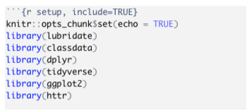
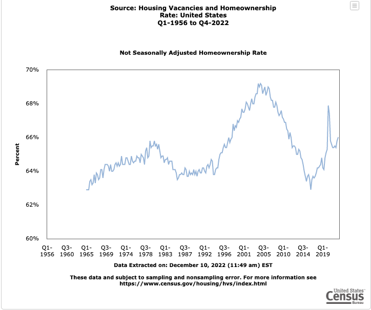
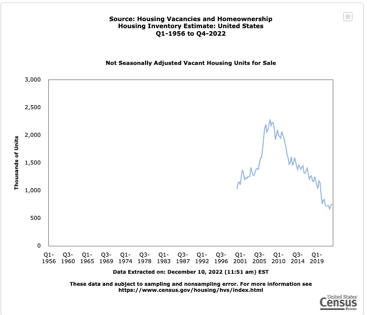
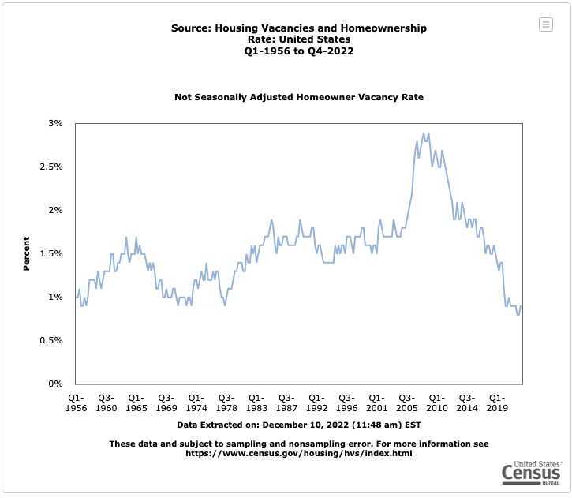
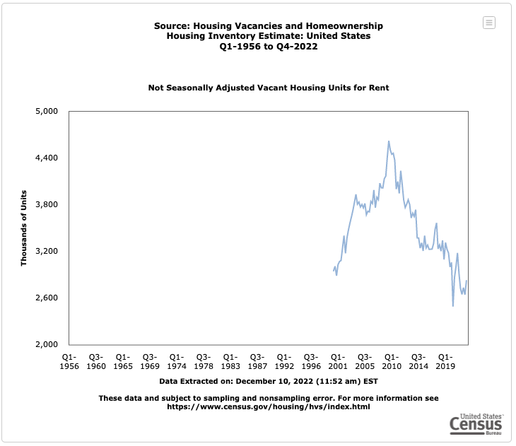
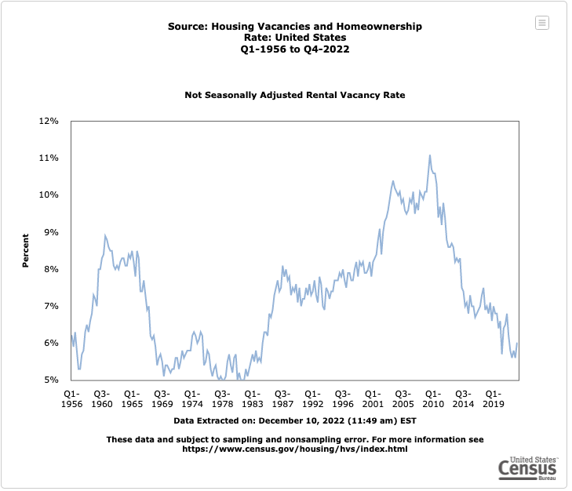
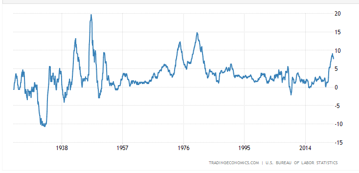
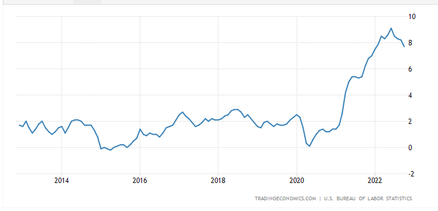
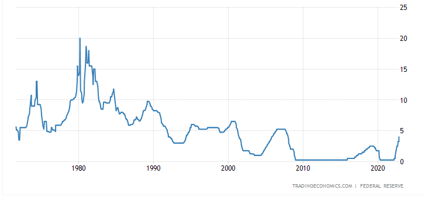
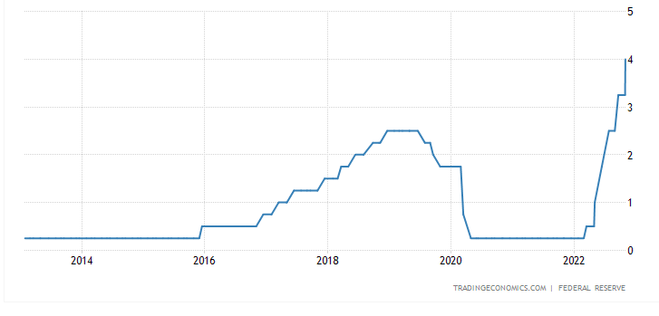

```{r setup, include=FALSE}
library(knitr)
knitr::opts_chunk$set(echo = FALSE, warning = TRUE)


knit_hooks$set( fig.cap = function(before, options, envir) {
  if ( before ) {
    chr <- sprintf("<p><small><strong><a name='fig:%s' value = %d>Figure %d</a></strong>: %s</small></p>", options$label, options$fig.num, options$fig.num, options$fig.cap)
    chr <- sprintf("<p><small><strong><a name='fig:%s'>%s</a></strong>: %s</small></p>", options$label, options$label,  options$fig.cap)
    
    return(chr)
  }
})


chunkref <- local({
  function(chunklabel) {
    sprintf('[%s](#%s)', chunklabel, paste0("fig:",chunklabel) )
  }  
})

library(lubridate)
library(classdata)
library(dplyr)
library(tidyverse)
library(ggplot2)
library(httr)
```

# Analysis of the United States Housing Market (Mid 2016-Late 2022)

Authors: Nathan Buchanan

## **Abstract (TL;DR)**

This report examines the housing market of the United States from July 2016 until November of 2022 with a more direct focus on the median and average listing prices of the homes being put on the market. The United States has experienced a rather volatile housing market since the beginning of the COVID-19 pandemic starting in early 2020. There are likely hundreds of factors that could have contributed to this phenomena, and this report attempts to examine a couple of the factors such as inflation rates and the supply and demand of housing units. The data that I am using comes from a Realtor website, source linked below, as well as United States census data which is also linked below. From the analysis of this data I was able to determine that the housing in the United States has increased in some areas by over 100% since 2016. Such a steep increase in price over such a small period of time is definitely abnormal and is likely caused by a multitude of factors acting in conjunction with one another. Factors such as supply and demand, rising inflation rates, and low interest rates likely all contributed to such a volatile market.

# **Intro/Background/Motivation**

The topic that will be discussed is directly focused on the housing market in the United States from July of 2016 to November of 2022. The United States has had a fairly tumultuous housing market since the turn of the millennium. With the most significant event being the housing market crash of 2008, which resulted in serious economic consequences for many financial sectors of the United States. The data that I am looking at is focused on the recent trends of the United States housing market with specific emphasis on the increase of prices since the COVID-19 pandemic began in March of 2020. When comparing solely the housing market data from 2008 and 2022 many similarities can be seen. However, the causes for the similarities likely differ, which indicates that the same outcomes are not guaranteed.

The group used data from the sources listed below and processed, formatted, and cleaned the data so it could be easily plotted to show applicable trends. All data processing was done through the "RStudio" program. The libraries used in this report include: lubridate, classdata, dplyr, tidyverse, ggplot2, and httr. Figure 1 displays how the libraries were loaded into the RStudio workspace.




**Figure 1:** RSudio Library

The first step that was taken in the exploration of the housing trends was to identify important statistical characteristics of the original housing market data that was downloaded from the Realtor website. The data that was downloaded included information such as date, state, median listing price, average listing price, and then further statistical data which analyzed how the data was changing. I first cleaned the data, creating a multitude of RStudio DataFrames so the data could be more easily read. After this an in depth analysis of the median and average listing price was done. I then grouped the data by state, with each state containing 77 data points, spanning from July of 2016 to November of 2022.

From the median and average listing price data I was able to show, through plotting the data, that a significant rise in both, median and average listing prices, occurred with the majority of increase happening starting in 2020. To further enhance the analysis I was able to show how the median and average listing price changed in relation to the first data point.

# Quick Data Summary

Figure 2 through Figure 8 shows the data and plots that were used to analyze the United States housing market from July 2016 to November 2022. Following each figure there is a small explanation of the variables that are being plotted, as well as the values of the variables. The explanation will then delve into to the trends that the plot is showing.

```{r, include = FALSE}
census_2021 <- read.csv("https://raw.githubusercontent.com/nwbuchanan/final-project/main/2021_housing_characteristics.csv")

census_2019 <- read.csv("https://raw.githubusercontent.com/nwbuchanan/final-project/main/2019_housing_characteristics.csv")
                        
census_2018 <- read.csv("https://raw.githubusercontent.com/nwbuchanan/final-project/main/2018_housing_characteristics.csv")

census_2017 <- read.csv("https://raw.githubusercontent.com/nwbuchanan/final-project/main/2017_housing_characteristics.csv")

census_2016 <- read.csv("https://raw.githubusercontent.com/nwbuchanan/final-project/main/2016_housing_characteristics.csv")

housing <- read.csv("https://econdata.s3-us-west-2.amazonaws.com/Reports/Core/RDC_Inventory_Core_Metrics_State_History.csv")

census_2016 <- census_2016 %>% select("Label..Grouping.",ends_with("Estimate")) %>% select(-"Puerto.Rico..Estimate")
census_2017 <- census_2017 %>% select("Label..Grouping.",ends_with("Estimate")) %>% select(-"Puerto.Rico..Estimate")
census_2018 <- census_2018 %>% select("Label..Grouping.",ends_with("Estimate")) %>% select(-"Puerto.Rico..Estimate")
census_2019 <- census_2019 %>% select("Label..Grouping.",ends_with("Estimate")) %>% select(-"Puerto.Rico..Estimate")
census_2021 <- census_2021 %>% select("Label..Grouping.",ends_with("Estimate")) %>% select(-"Puerto.Rico..Estimate")

census_2016 <- data.frame(t(census_2016))
census_2017 <- data.frame(t(census_2017))
census_2018 <- data.frame(t(census_2018))
census_2019 <- data.frame(t(census_2019))
census_2021 <- data.frame(t(census_2021))

colnames(census_2016) <- as.character(census_2016[1,])
colnames(census_2017) <- as.character(census_2017[1,])
colnames(census_2018) <- as.character(census_2018[1,])
colnames(census_2019) <- as.character(census_2019[1,])
colnames(census_2021) <- as.character(census_2021[1,])

census_2016 <- census_2016[-1,]
census_2017 <- census_2017[-1,]
census_2018 <- census_2018[-1,]
census_2019 <- census_2019[-1,]
census_2021 <- census_2021[-1,]

housing <- housing %>% mutate(
  Date = ym(month_date_yyyymm),
  Year = year(Date),
  Month = month(Date),
)

housing_clean <- housing %>% filter(quality_flag==0)
housing_2016 <- housing %>% filter(Year==2016)
housing_2017 <- housing %>% filter(Year==2017)
housing_2018 <- housing %>% filter(Year==2018)
housing_2019 <- housing %>% filter(Year==2019)
housing_2020 <- housing %>% filter(Year==2020)
housing_2021 <- housing %>% filter(Year==2021)
housing_2022 <- housing %>% filter(Year==2022)
housing_december <- housing %>% filter(Month==12)
housing_january <- housing %>% filter(Month==1)
housing_august <- housing %>% filter(Month==8)
marshall <- housing %>% filter(state == "marshall islands")
housing <- housing %>% filter(state != "marshall islands") 
housing <- housing[-3928,]

list1 <- c("Hawaii","District of Columbia","California","Colorado","Massachusetts","Oregon","Utah","Washington","Connecticut","Montana")

list2 <- c("New York", "Rhode Island", "Florida","Nevada","Arizona","New Jersey","Maryland","New Hampshire","Delaware","Alaska")

list3 <- c("Virginia", "Texas", "Idaho", "Vermont", "North Carolina","Minnesota","South Carolina","North Dakota","Georgia","Wyomng")

list4 <- c("Tennessee","New Mexico","South Dakota","Maine","Louisana","Illinois","Nebraska","Alabama","Wisconsin","Oklahoma")

list5 <- c("Pennsylvania","Mississippi","Iowa","Kentucky","Arkansas","Missouri","West Virginia","Michigan","Kansas","Indiana","Ohio")

difference <- housing %>% group_by(state) %>% summarize(
  count = n(),
  median_difference = median_listing_price-median_listing_price[month_date_yyyymm==201607],
  median_percent_difference = 100*median_difference/median_listing_price[month_date_yyyymm==201607],
  average_difference = average_listing_price-average_listing_price[month_date_yyyymm==201607],
  average_percent_difference = 100*average_difference/average_listing_price[month_date_yyyymm==201607],
  Date = Date,
  Year = Year,
  Month = Month
)

census_2016$States <- row.names(census_2016)
census_2016 <- census_2016[, !duplicated(colnames(census_2016))]

census_2016 <- census_2016 %>% summarize(
  States = census_2016$States,
  Total_Housing = census_2016$`    Total housing units`,
  Occupied_Housing = census_2016$`    Occupied housing units`,
  Vacant_Housing = census_2016$`        Vacant housing units`,
  Homeowner_Vacancy = census_2016$`    Homeowner vacancy rate`,
  Rental_Vacancy = census_2016$`    Rental vacancy rate`,
  Built_2010 = as.numeric(census_2016$`        Built 2014 or later`)+as.numeric(census_2016$`        Built 2010 to 2013`),
  Price_Median = census_2016$`        Median (dollars)`,
  Year = 2016
)

census_2017$States <- row.names(census_2017)
census_2017 <- census_2017[, !duplicated(colnames(census_2017))]
census_2017 <- census_2017 %>% summarize(
  States = census_2017$States,
  Total_Housing = census_2017$`    Total housing units`,
  Occupied_Housing = census_2017$`    Occupied housing units`,
  Vacant_Housing = census_2017$`        Vacant housing units`,
  Homeowner_Vacancy = census_2017$`    Homeowner vacancy rate`,
  Rental_Vacancy = census_2017$`    Rental vacancy rate`,
  Built_2010 = as.numeric(census_2017$`        Built 2014 or later`)+as.numeric(census_2017$`        Built 2010 to 2013`),
  Price_Median = census_2017$`        Median (dollars)`,
  Year = 2017
)

census_2018$States <- row.names(census_2018)
census_2018 <- census_2018[, !duplicated(colnames(census_2018))]
census_2018 <- census_2018 %>% summarize(
  States = census_2018$States,
  Total_Housing = census_2018$`    Total housing units`,
  Occupied_Housing = census_2018$`    Occupied housing units`,
  Vacant_Housing = census_2018$`        Vacant housing units`,
  Homeowner_Vacancy = census_2018$`        Homeowner vacancy rate`,
  Rental_Vacancy = census_2018$`        Rental vacancy rate`,
  Built_2010 = as.numeric(census_2018$`        Built 2014 or later`)+as.numeric(census_2018$`        Built 2010 to 2013`),
  Price_Median = census_2018$`        Median (dollars)`,
  Year = 2018
)
census_2019$States <- row.names(census_2019)
census_2019 <- census_2019[, !duplicated(colnames(census_2019))]
census_2019 <- census_2019 %>% summarize(
  States = census_2019$States,
  Total_Housing = census_2019$`    Total housing units`,
  Occupied_Housing = census_2019$`    Occupied housing units`,
  Vacant_Housing = census_2019$`        Vacant housing units`,
  Homeowner_Vacancy = census_2019$`        Homeowner vacancy rate`,
  Rental_Vacancy = census_2019$`        Rental vacancy rate`,
  Built_2010 = as.numeric(census_2019$`        Built 2014 or later`)+as.numeric(census_2019$`        Built 2010 to 2013`),
  Price_Median = census_2019$`        Median (dollars)`,
  Year = 2019
)

census_2021$States <- row.names(census_2021)
census_2021 <- census_2021[, !duplicated(colnames(census_2021))]
census_2021 <- census_2021%>% summarize(
  States = census_2021$States,
  Total_Housing = census_2021$`    Total housing units`,
  Occupied_Housing = census_2021$`    Occupied housing units`,
  Vacant_Housing = census_2021$`        Vacant housing units`,
  Homeowner_Vacancy = census_2021$`        Homeowner vacancy rate`,
  Rental_Vacancy = census_2021$`        Rental vacancy rate`,
  Built_2010 = as.numeric(census_2021$`        Built 2020 or later`)+as.numeric(census_2021$`        Built 2010 to 2019`),
  Price_Median = census_2021$`        Median (dollars)`,
  Year = 2021
)

census_data <- rbind(census_2016,census_2017,census_2018,census_2019,census_2021)
census_data$States <- gsub('..Estimate','',census_data$States)

ggplot(census_data,aes(x=Year,y=Built_2010,group=States,color=States))+geom_point()+geom_line()+theme(legend.position = 'none')
```

```{r, include =TRUE}
ggplot(housing,aes(x=reorder(state,median_listing_price,decreasing=TRUE),y=median_listing_price,color=state))+theme(legend.position = 'none') +geom_boxplot()+theme(axis.text.x = element_text(angle=90,size=8))+ggtitle("Median Listing Price")
```

**Figure 2:** Median Listing Price Boxplot


Figure 2 is a boxplot with the x-axis containing the States variable and the y-axis containing a Median Listing Price variable. As mentioned above each state has 77 data points associated with it, this means that each box for each state is dependent on 77 data points. From figure 2 two clear trends can be determined. Firstly the median listing price for the states are differing, and in the figure they are plotted in a descending order from left to right. The second thing that can be determined is that there are very few outliers in the data. There are definitely some outliers which fall outside of the boxplots, but it is important to note that all outliers lie above the boxplots. This is a significant trend, as it signals that the data is scewed upward.

```{r, include = TRUE}

ggplot(housing,aes(x=reorder(state,average_listing_price,decreasing=TRUE),y=average_listing_price,color=state)) +geom_boxplot()+theme(axis.text.x = element_text(angle=90,size=8)) + theme(legend.position = 'none')+ggtitle("Average Listing Price")

```

**Figure 3:** Average Listing Price Boxplot


Figure 3 mimics that of figure 2 as each figure contains the State variable on the x-axis, however in figure 3 the y-axis is modeling the Average Listing Price variable from the data. The first noticable difference in the two plots is that the average price is significantly larger than the median price, and that there are less outliers in the Average Listing Price plot. The price difference is likely due to very few but expensive large properties being bought. For this reason the Median Listing Price is the better variable to use when analyzing the data.

```{r,include=TRUE}
housing_august %>% filter(Year==2016) %>% ggplot(aes(x=reorder(state,median_listing_price,decreasing=TRUE),y=median_listing_price,fill=state)) +geom_bar(stat="identity")+theme(legend.position='none',axis.text.x = element_text(angle=90,size=10))+ggtitle("Median Listing Price, August 2016")
```

**Figure 4:** August 2016 Median Listing Price Barchart

Figure 4 is a plot of the State variable on the x-axis and Median Listing Price on the y-axis. More specifically the data is from the month of August in 2016. This is one of the first months that the data exists for. An important feature from the plot is that the median listing price ranges from approximately 150,000 dollars to just over 600,000 dollars, with the vast majority of States being somewhere between 200,000 and 400,000 dollars.

```{r, include=TRUE}
housing_august %>% filter(Year==2022) %>% ggplot(aes(x=reorder(state,median_listing_price,decreasing=TRUE),y=median_listing_price,fill=state)) +geom_bar(stat="identity")+theme(legend.position='none',axis.text.x = element_text(angle=90,size=10))+ggtitle("Median Listing Price, August 2022")

```

**Figure 5:** August 2022 Median Listing Price Barchart

Figure 5 is very similar to figure 4 with the State variable on the x-axis and Median Listing Price on the y-axis. However, this plot is showing data from August 2022 instead of 2016. From this figure it is very easy to tell that the Median Listing Price data had significantly increased over the span of the 6 years. The maximum value increased to close to 900,000 dollars and the majority of states are now between 300,000 and 500,000 dollars.

```{r,include=TRUE}
ggplot(housing, aes(x=Date,y=median_listing_price,group=state,color=state))+geom_line()+geom_point()+theme(legend.position = 'none')+ggtitle("Median Listing Price Scatterplot Grouped by State")
```

**Figure 6:** Median Listing Price Scatterplot

Figure 6 is a scatterplot which is plotting every Median Listing Price datapoint in the dataset labeled by its date (x-axis). Each color in the scatterplot represens a state, which signals that the plot is grouped by the variable State. From the figure it is relatively easy to follow each state and how the median listing price is changing as the time increases. The same conclusion that was drawn from Figures 4 and 5 can be drawn from Figure 6 as well. The median listing price is increasing over the 6 year span that was analyzed. Figure 6 does allow for further analysis of how it is changing though. From the data it can be determined that the majority of housing increase occurred from the years 2020 to 2022.


```{r, include=TRUE}
ggplot(difference,aes(x=Date,y=median_difference,color=state,group=state))+geom_point()+geom_line()+theme(legend.position='none')+ggtitle("Change in Median Listing Price")
```

**Figure 7:** Median Listing Price Difference Scatterplot

Figure 7 is a scatterplot with a line graph showing the difference in Median Listing Price at a certain date with respect to the initial datapoint, which was July 2016. From this graph it is easier to see how the data is changing because the y-axis bounds of the graph are smaller than it was in figure 6. From this graph we can see that some of the states experienced an increase in median listing price of over 300,000 dollars, while the minimum amount of increase was at least 50,000 dollars. It can also be seen that prior to 2020 some of the states actually experienced a decrease in median listing price, making the total increase even more significant.

```{r,include=TRUE}
ggplot(difference,aes(x=Date,y=median_percent_difference,color=state,group=state))+geom_point()+geom_line()+theme(legend.position='none')+ggtitle("Percent Change in Median Listing Price")
```

**Figure 8:** Median Listing Price Difference Percent Scatterplot

Figure 8 is a continuation of figure 7, but instead of showing a difference value in terms of actual dollars the scatterplot is showing the percent increase from the intial data point in July 2016. This plot shows how states median listing prices change in relation to its original price which is a more accurate representation of how much the housing market has changed in the last 6 years. From this it can be seen that figure 8 follows the same general shape as figure 7. It can also be seen that some states experienced a decrease in price prior to 2020, when the majority of increases began. Lastly it can be determined that some states experienced an increase in median listing price of over 100%, meaning that the housing market in those states actually doubled in the 6 year span. The majority of states experienced a 40-80% increase.

## Results 1

One of the major contributors of any pricing index is supply and demand. Data from trading economics helped me analyze the supply and demand of the housing market in the United States. Figure 9 through figure 13 are plots showing the supply and demand of the housing market.



**Figure 9:** Homeownership Rate

Figure 9 is a graph showing the homeownership rates in the United States. From the graph we can see that the trend is fairly sinusoidal, meaning that when homeownership rates are low it is expected that it will increase, meaning more potential homebuyers in the market for houses, and when homeownership rates are high fewer potential buyers will be in the market. From the graph it can be seen that in 2016 homeownership rates were very low, signalling that more potential homebuyers would be in the market to buy a house. This trend was confirmed as homeownership rates increased from 2016 to 2021. This meant that the demand for homes from 2016 to 2022 was increased compared to previous years. With an increase in demand the prices of homes would increase during this time period, purely based off of demand for homes.



**Figure 10:** Vacant Housing Units for Sale

Figure 10 is showing the amount of vacant housing units in the United States that are up for sale. From the graph it can be seen that housing units for sale in the United States were decreasing from 2016 to 2022. This means that the supply of homes for sale would be decreasing. A decrease in supply would cause homes to increase in price to balance the market.



**Figure 11:** Homeowner Vacancy Rate

Figure 11 is very similar to figure 10, but instead of showing the units for sale it is instead graphing homeowner vacancy rates. This is a percentage rate of total homes that are vacant, this would be unlivable houses, second homes, and vacation homes. The data shows that the percentage of homes that were vacant were decreasing over the timespan in question. This means that fewer total homes were vacant, meaning that fewer homes could potentially be put on the makret. This would further limit the supply of homes on the market, driving the price upward.



**Figure 12:** Vacant Housing Units for Rent



**Figure 13:** Rental Vacancy Rates

Figures 12 and 13 show the vacant housing units for rent and the rental vacancy rates respectively. The significance of rental rates would be that the fewer possible rental units would make renting more expensive, driving more people to look to buy a home instead of renting a home. From the data it can be seen that there were in fact fewer rental opportunities for individuals from 2016 to 2022 as both graphs show a downward trend.

Overall figures 9 through 13 show a decrease in supply of homes available for both rent and ownership. This would significantly drive up the prices of homes which is consistent with the data that was analyzed in the data summaries. The only way for the decrease in supply to not affect the market is if there was significant decrease in demand, however from figure 9 it can be inferred that there would be an increase in demand for homes in the 2016 to 2022 timeframe. Even if the demand slightly decreased it is likely that the price of homes would still increase because of the drastic decrease in supply. The supply and demand trends are strongly correlated to the data, however it likely does not explain why the housing market increased so much from 2016-2022, only a small part.

## Results 2

The next factor that I analyzed was the inflation rates of the United States during this time. Inflation rates would affect the housing market because inflation typically affects the price of all goods. This would mean things such as building costs, renovation costs, inspection costs, and shipping costs would all increase, driving up the overall price of homes. Figures 14 and 15 analyze the inflation rates of the United States.



**Figure 14:** Historic Inflation Rates



**Figure 15:** 10 Year Inflation Rates

From figures 14 and 15 it can seen that inflation rates in the United States have been fairly sporadic historically. However following the year 1980 inflation rates leveled out and remained relatively consistent until the housing market crash and subsequent recession in 2008. Following this time period inflation once again leveled out. From 2016 to 2020 the inflation rates were relatively steady at about 2-2.5%. The impact that this inflation rate would have on the housing market would be rather minimal with only a slight increase in price. This is what was seen from the data in the data summaries. From 2020 to 2022 inflation rates in the United States skyrocketed to highs that hadn't been seen since 1980. This huge jump in inflation rates corresponds with the largest increase in home prices, indicating a strong correlation between inflation rates and the housing market. Once again because of the huge jump in home prices, the inflation rate data likely only contributed to a fraction of the overall increase in housing prices.

## Results 3

The third factor that I analyzed was interest rates set by the United States Federal Reserve. Low interest rates promotes and encourages people to borrow and spend money so that the economy will grow. This influx of cash would cause inflation rates to slightly increase which was already discussed in the previous section. Low interest rates would also allow individuals to get approved for larger loans, so any bidding wars for homes would contain more people, further driving up the price of the house. Figures 16 and 17 show the interest rates for the United States.



**Figure 16:** Historic Interest Rates



**Figure 17:** 10 Year Interest Rates

From figures 16 and 17 it can be seen that much like inflation the interest rates for the United States have been sporadic historically with very high interst rates prior to 1980. After the 2008 recession the Federal Reserve lowed the interest rates to a fraction of a percent to promote spending to stimulate the economy. Once the economy was "recovered" for lack of a better term the Federal Reserve began raising interest rates. This can be seen from 2016 to 2020. Once Covid-19 restriction happened and the economy turned downward interest rates were slashed once again. This allowed individuals to take out larger loans and likely contributed to the increase in pricing for houses. The interest rates raising in 2022 show the Federal Reserve attempting to curb inflation and the effects will likely be seen in the coming months. Some of the effects have already been seen, as the tail end of 2022 has shown a decrease in inflation rate, and a decrease in home pricing. 

# Conclusions

From the data summaries it became apparent that the United States housing market had significantly increased from the year 2016 to the year 2022. The vast majority of the increases occured after 2020, when the effects of Covid-19 were very apparent. This report and data analysis looked at 3 different variables that could have potentially affected the housing market to increase so drastically. 

The first factor that was analyzed was the supply and demand of the housing market. This was done by looking at homeownership rates, home vacancy rates, and rental rates. It was determined that there was a strong correlation between supply and demand and the housing market increase as the supply of homes was decreased over this time period and the demand for homes was likely slightly higher. Due to the extreme increase in house pricing it is unlikely that supply and demand would account for all housing increases.

The second factor that was analyzed was inflation rates of the United States. Once again there was likely a strong correlation between inflation rates and the housing market increase as inflation rates drastically increased when the housing market drastically increased. The inflation rates affected the cost of building new homes, inspecting existing homes, and rennovating homes, driving the price upwards. This factor likely worked in conjunction with the supply and demand factor to affect the housing market. 

The last fact that was analyzed was interest rates of the United States. Low interest rates would promote borrowing and spending money. This would allow individuals to get larger loans and offer more money for the houses. Once again there was a correlation between low interest rates and an increase in housing prices. It should also be noted that there was a correlation between interest rates and inflation rates. This correlation likely impacted the correlation between interest and housing prices. 

All the factors in this report were found to have significant correlation with the housing market increase. It is likely that all the factors analyzed actually have significant correlation among one another as well. If there was more time, and for future projects it would be interesting to analyze the state levels of each the three factors. The census data in this report contains some of the state by state levels but due to time restrictions and lack of group effort much of that data was left unanalyzed.


# Criticisms/Scepticisms

Due to using data that was not analyzed within RStudio I am not as familiar with the ins and outs of the data. This makes drawing conclusions from the data more difficult. All correlations were made via visually analyzing the data. Upward trends in the housing market were compared to either upward trends in inflation data, or downward trends in interest rates. This means that a lot of the correlations were made based on assumptions. The most assumptions were made in the supply and demand section. There was not one singular variable that showed supply and demand so multiple variables had to be used to determine supply and demand. These methods were not as scientific and accurate as I would have liked them to be. With more time and more available data the methods used could have been better.

The original data also contained other variables such as; time on the market, new listings, total existing listings and many more that would have been nice to analyze. The main criticism I have of my report is that it seems unfinished. I was expecting help with the report and data analysis and so I did not analyze all the factors that I could have.  

If I had known that I was doing the project on my own I would have done more data pulling and cleaning so that better conclusions could have been made.I would have liked to have more time to analyze all the data myself within RStudio so that I could plot the data on top of each other to see better correlations. Even with the limitations I induced on myself I felt the analysis was sound and the logic behind the analysis was sound. 


## Data source

All data came from https://www.realtor.com/research/data/. The data that was used can be found under the historical monthly data section.

All Census data came from https://www.census.gov/.

## References

All factor analysis data came from https://tradingeconomics.com/united-states/gdp-growth-annual#:~:text=GDP%20Annual%20Growth%20Rate%20in,the%20second%20quarter%20of%202020.

The webset tradingeconomics required a membership and payment for raw data, and I could not find the raw data so I chose to you there premade charts instead.
